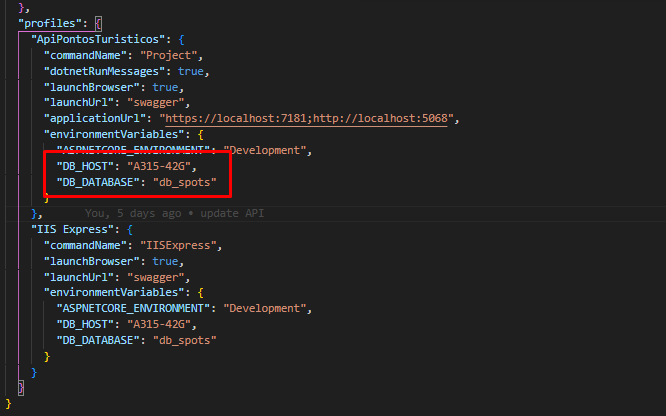
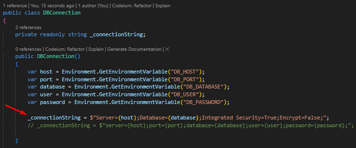

# crudSpots

Este repositório contém um projeto de cadastro de pontos turísticos chamado `crudSpots`. O frontend foi desenvolvido utilizando o `Create React App`. A interface faz uso de bibliotecas como `React Bootstrap` para estilização e `SweetAlert2` para notificações.

O backend da aplicação é composto por uma API desenvolvida em C# usando o framework ASP.NET Core. Ela é responsável por gerenciar os dados dos pontos turísticos, realizando operações de CRUD sobre eles. As interações com o banco de dados são feitas via stored procedures, e a API expõe endpoints que o frontend consome para exibir e manipular os dados dos pontos turísticos.

A API  é composta por um controlador que lida com as requisições HTTP, serviços que encapsulam a conexão com o banco de dados configurando a lógica de negócios e objetos de transferência de dados (DTOs) que facilitam a comunicação entre camadas.

## Requisitos mínimos para compilação

* .NET 6.0
* Node.js 14.16.0
* npm 6.14.11
* Visual Studio 2019
* Visual Studio Code

## Tutorial de instalação e configuração do SQL SERVER

### 1. Baixe e instale o SQL Server

Acesse o site da Microsoft e [baixe o SQL Server Express](https://www.microsoft.com/pt-br/sql-server/sql-server-downloads).

### 2. Instale o SQL Server Management Studio (SSMS)

Acesse o site da Microsoft e [baixe o SSMS](https://docs.microsoft.com/pt-br/sql/ssms/download-sql-server-management-studio-ssms?view=sql-server-ver15).

### 3. Crie um novo banco de dados

Abra o SSMS e conecte-se ao servidor local. Clique em "Nova Consulta" e execute o seguinte comando: `CREATE DATABESE db_spots; USE db_spots;`;

### 4. Execute os Scripts localizados na pasta /ScriptsBanco/SQL_SERVER

Abra a pasta ScriptsBanco/SQL_SERVER e execute os arquivos na sequência no banco de dados recém criado.

## Tutorial de instalação do projeto

### 1. Instale o .NET 6.0

Acesse o site da Microsoft e [baixe o .NET 6.0](https://dotnet.microsoft.com/download/dotnet/6.0).

### 2. Instale o Node.js 14.16.0

Acesse o site do Node.js e [baixe o Node.js 14.16.0](https://nodejs.org/en/download/).

### 3. Abra o Visual Studio Code

Abra o Visual Studio Code e instale as extensões necessárias para o desenvolvimento do projeto.

### 4. Clone o repositório

Clone o repositório do projeto com o comando `git clone https://github.com/PierreSalves/crudSpots`.

### 5. Acesse a pasta do projeto

Acesse a pasta do projeto com o comando `cd crudSpots`.

### 6. Instale as dependências do frontend

Acesse a subpasta do front-end com o comando `cd SpotsFrontEnd`.
Instale as dependências do frontend com o comando `npm install`.

### 7. Execute o frontend

Execute o frontend com o comando `npm start`.

### 8. Abra o Visual Studio 2019

Abra o Visual Studio 2019 e abra o projeto `ApiPontosTuristicos.sln`.

### 9. Configure o acesso da API com o Banco de Dados

Edite os campos DB_HOST e DB_DATABASE localizados no arquivo /SpotsApi/Properties/launchSettings.json,
No campo DB_HOST coloque o nome do servidor SQLSERVER
No campo DB_DATABASE coloque o nome do banco de dados criado.

Novos campos de conexão podem ser configurados conforme a instalação do SQL SERVER

Modifique a connectionString conforme necessário.

### 10. Execute a API

Execute a API com o comando F5.

### 11. Acesse a API

Acesse a API com o endereço `https://localhost:7181/api/Spots/`.

Agora você  já  pode acessar o frontend em `http://localhost:3000/` e interagir com a API.
